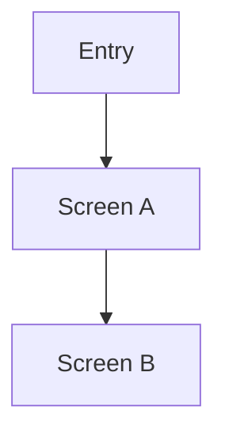

# UI Design

> UI/UX媛€ ?덈뒗 ?꾨줈?앺듃?먯꽌留??ъ슜?섎뒗 ?ㅺ퀎 臾몄꽌?낅땲??  
> UI 鍮꾨????꾨줈?앺듃?쇰㈃ ?곷떒??`Not required for this scope`瑜?湲곕줉?섍퀬 ?좎??⑸땲??

## Quick Read
- ?대쾲 踰붿쐞??UI 紐⑺몴:
- ?꾩옱 ?ㅺ퀎 ?€???붾㈃:
- ?대쾲 臾몄꽌?먯꽌 瑗?吏€耳쒖빞 ???먮쫫:
- 湲덉???UI ?댁꽍 ?먮뒗 ?앸왂:
- ?뚯뒪?????볦튂硫????섎뒗 ?ъ씤??
- ?ㅼ쓬 ??븷???쎌뼱????踰붿쐞:

## Applicability
- Status: Required / Not required for this scope
- Reason:
- Last Updated At: [YYYY-MM-DD HH:MM]

## Current UI Scope
- Current screen / route:
- Current design task IDs:
- Related implementation scope:

## Must Preserve Interactions
- [?듭떖 interaction 洹쒖튃]
- [?듭떖 validation 洹쒖튃]
- [?듭떖 empty/loading/error 洹쒖튃]

## Changelog
- [YYYY-MM-DD] Designer: initial draft

## UX Goal
- ?ъ슜?먭? ?대뼡 ?먮쫫?쇰줈 ?대뼡 媛€移섎? ?삳뒗媛€:

## Screen Map

| Screen / Route | Purpose | Entry Point | Exit / Next Action |
|---|---|---|---|
| [ScreenA] | [紐⑹쟻] | [吏꾩엯] | [?대룞] |

## Navigation / Flow


## Screen Specs

### Screen A
- Goal:
- Key components:
- User actions:
- Empty / loading / error states:
- Validation rules:

### Screen B
- Goal:
- Key components:
- User actions:
- Empty / loading / error states:
- Validation rules:

## Component Hierarchy
```text
ScreenA
  Header
  Content
    Form
    ActionButton
```

## Design Tokens
- Colors:
- Typography:
- Spacing:
- Feedback / status styles:

## Accessibility / Localization
- ?묎렐???붽뎄?ы빆:
- ?ㅺ뎅??濡쒖뺄?쇱씠吏??붽뎄?ы빆:

## Developer Notes
- 援ы쁽 ??諛섎뱶??吏€耳쒖빞 ??interaction:
- ?뚯뒪????瑗??뺤씤??UI ?ъ씤??

